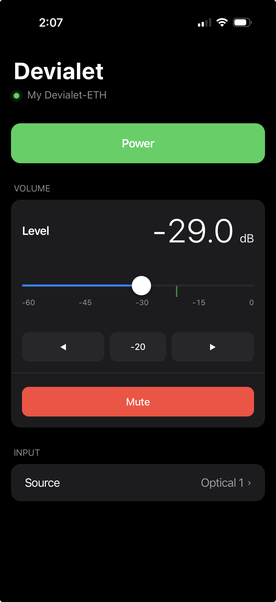

# Devialet Expert Pro Network Control

Complete solution for controlling Devialet Expert Pro amplifiers over the network, including phone/browser control. 

Developed for and tested with an Expert 440 Pro; seems to work with single-chassis amps. About 95% vibe coded by Claude Code.

## Overview

This project provides three ways to control your Devialet Expert Pro:

1. **Command-line tool** - Direct control via terminal
2. **Web interface** - Mobile-friendly browser interface (iPhone, iPad, desktop)
3. **REST API** - For automation and integration

## Quick Start

### Command-Line Control

```bash
# Get status
python3 devialet_expert_control.py status

# Turn on and set volume
python3 devialet_expert_control.py on
python3 devialet_expert_control.py volume -20

# Switch to Phono
python3 devialet_expert_control.py channel 1
```

### Phone/Browser Control

```bash
# 1. Install dependencies
pip3 install -r requirements.txt

# 2. Start web server
python3 devialet_web_server.py

# 3. Open browser on phone and go to:
#    http://<your-server-ip>:5000
```



## Files

### Core Control
- **`devialet_expert_control.py`** - Main control script and library
- **`DEVIALET_EXPERT_PRO_API.md`** - Complete protocol documentation

### Web Interface
- **`devialet_web_server.py`** - Flask web server with REST API
- **`devialet_web_interface.html`** - Mobile-friendly web UI
- **`requirements.txt`** - Python dependencies (Flask, flask-cors)
- **`WEB_SERVER_SETUP.md`** - Detailed setup guide for web server

### Testing & Documentation
- **`README.md`** - This file

## Features

### Supported Commands
- ✅ Power on/off/toggle
- ✅ Volume control
- ✅ Mute/unmute/toggle
- ✅ Channel selection
- ✅ Status monitoring (power, volume, mute, channel)

### Web Interface Features
- 📱 Mobile-optimized, touch-friendly design
- 🌓 Dark/light mode (follows system preference)
- 🔄 Auto-refreshing status
- 🎚️ Volume slider with real-time feedback
- 🎛️ One-tap channel switching
- ⚡ Fast and responsive

### API Features
- 🔌 RESTful JSON API
- 📡 CORS enabled for cross-origin requests
- 🔍 Health check endpoint
- 📊 Detailed status information

## Requirements

- Python 3.7 or higher
- Devialet Expert Pro on same network
- For web interface: Flask and flask-cors

```bash
pip3 install -r requirements.txt
```

## Usage Examples

### Command Line

```bash
# Auto-discover amp and show status
python3 devialet_expert_control.py status

# Turn on, switch to Phono, set volume for vinyl listening
python3 devialet_expert_control.py on
python3 devialet_expert_control.py channel 1
python3 devialet_expert_control.py volume -25

# Quick mute toggle
python3 devialet_expert_control.py toggle-mute
```

### Web API

```bash
# Get status
curl http://localhost:5000/api/status

# Turn on
curl -X POST http://localhost:5000/api/power/on

# Set volume to -20 dB
curl -X POST http://localhost:5000/api/volume \
  -H "Content-Type: application/json" \
  -d '{"db": -20.0}'

# Switch to Phono
curl -X POST http://localhost:5000/api/channel \
  -H "Content-Type: application/json" \
  -d '{"channel": 1}'
```

### Python Library

```python
from devialet_expert_control import DevialetExpertController

# Create controller
controller = DevialetExpertController()

# Get status
status = controller.get_status()
print(f"Device: {status['device_name']}")
print(f"Volume: {status['volume_db']} dB")

# Control amp
controller.turn_on()
controller.set_volume(-20)
controller.set_channel(1)  # Phono
```

## Network Requirements

- Amp and control device must be on same network
- UDP ports 45454 and 45455 must be accessible
- For web server: HTTP port 5000 (or custom port)

## Known Limitations

1. **No authentication** - Accessible by anyone on your network
2. **~1 second status latency** - Amp broadcasts status once per second
3. **No push notifications** - Cannot receive immediate status updates
4. **Local network only** - No internet/remote access built in

## Known Bugs

- None currently

## Credits

- **Protocol reverse engineering:** Based on [gnulabis/devimote](https://github.com/gnulabis/devimote)
- **Phono channel discovery:** [gnulabis/devimote Issue #2](https://github.com/gnulabis/devimote/issues/2)
- **Expert Pro packet analysis:** Through systematic testing and Wireshark captures

## License

This documentation and code is provided as-is for educational and personal use. Devialet is a trademark of Devialet SAS. This project is not affiliated with or endorsed by Devialet.

## Getting Help

1. **Command-line help:** `python3 devialet_expert_control.py --help`
2. **Web server help:** `python3 devialet_web_server.py --help`
3. **API documentation:** See `DEVIALET_EXPERT_PRO_API.md`
4. **Web setup:** See `WEB_SERVER_SETUP.md`
